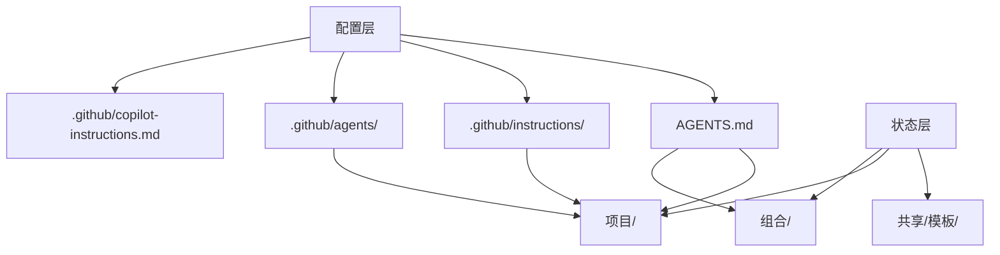
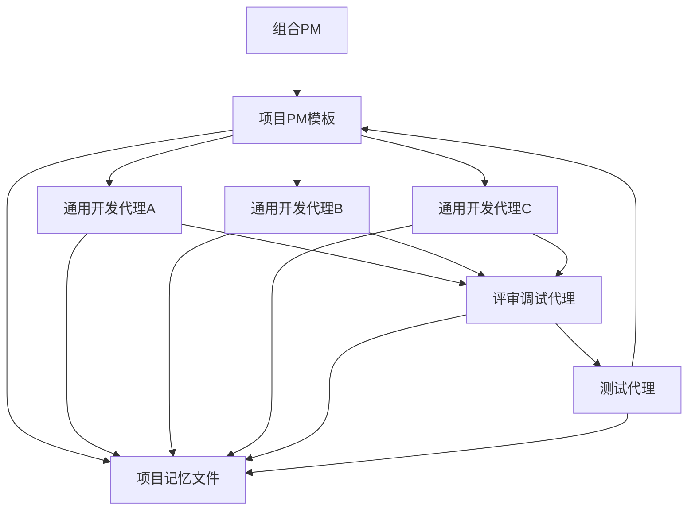
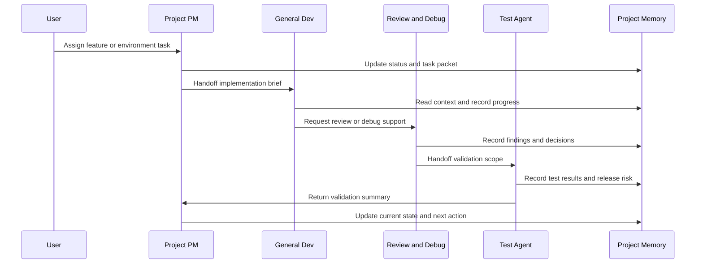

# 多 Agent 交付架构 V1

## 总体概览

- **业务价值**：构建一套可复用的多 Agent 交付系统，用来同时管理大约 5 个并行项目，保留项目记忆，并让新的 Agent 在切换后能快速接手。
- **核心产出**：基于 VS Code 自定义 agents 和持久化项目记忆文件，标准化规划、开发、评审、调试、测试、环境配置和状态跟踪的执行方式。
- **预计周期**：约 2.5 到 3.5 周完成一个稳定的 V1，包括 1 个 pilot 项目和随后扩展到其余项目。
- **优先级**：高。

## 需求分析

### 功能需求

- 支持 1 个可以统筹整个项目组合的 PM 角色。
- 支持在不重构系统的前提下扩展为多个 PM 角色。
- 支持多个通用开发 Agent，能够承担功能开发和环境配置任务。
- 支持 1 个负责代码评审和调试的问题发现型角色。
- 支持 1 个负责测试设计、执行、回归验证和发布前检查的测试角色。
- 保留完整项目记忆，使工作可以在 Agent 切换或时间间隔之后继续。
- 让项目组织足够清晰，使新切换进来的 Agent 可以快速进入状态。
- 支持大约 5 个项目并行推进。
- 保持第一版足够简单，能够直接运行在现有 VS Code custom agent 体系之上。

### 非功能需求

- 新切换进来的 Agent 启动阅读时间应控制在 3 分钟以内。
- 项目状态必须持久化到工作区文件中，不能只依赖聊天历史。
- 在可行情况下，角色边界应遵循最小权限原则。
- Handoff 必须明确、可审阅、可重复执行。
- 架构应当能够在后续扩展到外部编排和长期记忆平台。

### 范围边界

**本期范围内**

- 工作区级别的 custom agent 架构。
- 共享 instruction 体系。
- 多项目记忆结构。
- 标准化 handoff 协议。
- 状态跟踪与 PM 监管模型。
- PM、开发、Review/Debug、Test 的可执行角色模型。

**V1 暂不纳入**

- 面向所有项目的全自动后台编排。
- 企业级可视化大盘或独立的 Web 控制台。
- 将向量数据库或长期语义记忆作为强依赖。
- 跨仓库调度和组织级集中治理。
- 未经人工确认的自动分支或 PR 生命周期管理。

## 前置假设

- 这 5 个项目会放在同一个工作区，或者至少位于同一个工作根目录下。
- 你希望项目记忆是人可读、可纳入版本控制的。
- 你会以 VS Code custom agents、instructions、prompts 和 handoffs 作为主要操作界面。
- 重大实现、风险编辑、合并和发布仍保留人工确认。
- 第一版优先优化可靠性和连续性，而不是最大化自治。

## 推荐的 V1 架构

### 架构决策

**推荐方案**：使用 VS Code 原生 custom agents 作为角色层，使用文件化记忆作为持久状态层，使用标准化 handoff 文件作为切换层。

这个方案适合作为 V1，原因是：

- 它与当前实际使用的工具链直接匹配。
- 它避免在操作模型尚未稳定前过早建设外部 Agent 平台。
- 它让项目记忆同时对人和 Agent 可读、可审查。
- 因为所有 Agent 都读取同一套结构化文件，所以切换成本低。
- 如果后续项目组合扩张，也为接入 Mem0 或 LangGraph 预留了清晰升级路径。

### 配置层与状态层

这套工作区结构刻意分成两层，避免“工具配置”和“项目事实”混在一起。

**配置层**

- 主要放在 `.github/` 和根目录的 `AGENTS.md`。
- 负责定义 Agent 如何工作，而不是记录项目做到哪里。
- 内容包括：工作区说明、custom agents、instructions、角色边界、规则加载方式。
- 关键词是：`怎么做`。

**状态层**

- 主要放在 `组合/`、`项目/` 和 `共享/`。
- 负责记录项目事实、进度、交接、验证结果、环境说明和模板。
- 内容会随着项目推进持续变化，是 Agent 恢复上下文时真正要读的部分。
- 关键词是：`现在做到哪了`。

这样分层的原因是：

- 让 VS Code / Copilot 能稳定识别规则文件。
- 让项目记忆保持可读、可维护、可审查。
- 降低 Agent 切换时的认知负担。
- 避免把大量项目状态误塞进 always-on 指令文件。



### 拓扑



### 角色模型

| 角色         | V1 数量              | 职责                                               | 工具范围                                 | 调用方式       |
| ------------ | -------------------- | -------------------------------------------------- | ---------------------------------------- | -------------- |
| 组合PM       | 1                    | 负责组合优先级、跨项目依赖、全局风险和周期状态汇报 | 以阅读和规划为主，可有限更新状态文件     | 可见主 agent   |
| 项目PM模板   | 1 个模板，按项目复用 | 负责单项目待办、节奏、交接质量和验收对齐           | 以阅读为主，可有限更新项目状态和交接文件 | 可见或子 agent |
| 通用开发代理 | 2 到 4 个同能力副本  | 负责功能实现、重构、环境搭建、文档和工具修改       | 完整开发工具范围                         | 可见主 agent   |
| 评审调试代理 | 1                    | 负责代码评审、根因分析、故障隔离和回归检查         | 以只读为主，可在必要时进入受控修复模式   | 可见主 agent   |
| 测试代理     | 1                    | 负责测试策略、测试执行和发布前验证判断             | 可编辑测试文件并运行验证工具             | 可见主 agent   |
| 上下文加载器 | 1 个隐藏代理         | 读取项目状态并整理成精简启动摘要                   | 只读                                     | 隐藏子 agent   |
| 交接写入器   | 1 个隐藏代理         | 将当前会话状态整理成结构化交接文件                 | 仅限更新记忆和状态文件                   | 隐藏子 agent   |
| 环境引导器   | 1 个隐藏代理         | 建立或修复环境搭建说明和环境准备状态               | 有限编辑和终端权限                       | 隐藏子 agent   |

### Why this role split works

- The PM layer manages coordination, not implementation details.
- The developer layer stays generalist, which matches your requirement that dev agents can take on any assigned development or setup work.
- Review/debug is separated from implementation to reduce self-approval bias.
- Testing is separated so validation is not treated as an afterthought.
- Utility agents keep repetitive tasks standardized without cluttering the visible agent list.

## PM Architecture Recommendation

### Preferred V1 PM Model

Use **1 Portfolio PM + 1 reusable Project PM agent template**.

This is better than creating five separate PM agents immediately because:

- You only maintain one PM behavior definition.
- The project-specific state lives in files, not inside the PM persona.
- It scales to more than five projects without agent sprawl.
- It reduces instruction drift between PM variants.

### Optional V1.1 PM Expansion

If the five projects become very different in rhythm or domain, evolve to:

- 1 Portfolio PM
- 5 project-bound PM wrappers that all reuse the same PM core instructions
- 1 release PM for shared milestones or coordinated deployments

### PM Responsibilities by Layer

**Portfolio PM**

- Owns the portfolio roadmap.
- Prioritizes projects.
- Tracks shared blockers.
- Detects collisions in team or environment capacity.
- Produces weekly executive status.

**Project PM**

- Maintains project backlog health.
- Turns goals into task packets for dev agents.
- Verifies handoffs contain enough context.
- Checks review/test gates are complete.
- Updates current sprint status and next recommended step.

## Memory Architecture

### Design Principle

Do not rely on chat history as the source of truth. The source of truth should be a small set of durable, structured project artifacts that every agent reads and updates.

### Memory Layers

| Layer                  | Scope                  | Persistence     | Format          | Owner                  |
| ---------------------- | ---------------------- | --------------- | --------------- | ---------------------- |
| Operating Instructions | Whole workspace        | Long-lived      | Markdown        | Human + Portfolio PM   |
| Portfolio Memory       | All projects           | Long-lived      | Markdown + YAML | Portfolio PM           |
| Project Memory         | Single project         | Long-lived      | Markdown + YAML | Project PM             |
| Session Handoff        | Current workstream     | Short-to-medium | Markdown        | Active agent           |
| Decision Record        | Architectural choices  | Long-lived      | ADR markdown    | PM or senior dev agent |
| Validation Record      | Tests and verification | Medium          | Markdown + YAML | Test agent             |

### 推荐目录结构

```text
.github/
  copilot-instructions.md
  agents/
    组合PM.agent.md
    项目PM.agent.md
    通用开发.agent.md
    评审调试.agent.md
    测试工程师.agent.md
    context-loader.agent.md
    交接写入器.agent.md
    env-bootstrap.agent.md
  instructions/
    global/
      运行模型.instructions.md
      交接规则.instructions.md
      状态格式.instructions.md
    projects/
      project-memory.instructions.md
      task-packet.instructions.md
    testing/
      验证策略.instructions.md
    review/
      review-severity.instructions.md
AGENTS.md
组合/
  组合索引.md
  组合路线图.yaml
  依赖关系.yaml
  每周状态/
    2026-03-16.md
项目/
  项目-A/
    项目简报.md
    项目状态.yaml
    当前上下文.md
    交接.md
    待办列表.yaml
    决策/
      ADR-0001.md
    验证/
      最新测试报告.md
    环境/
      环境搭建.md
      已知问题.md
  项目-B/
  项目-C/
  项目-D/
  项目-E/
共享/
  模板/
    任务包模板.md
    交接模板.md
    状态模板.yaml
    adr-template.md
```

### Required Artifacts Per Project

| 文件         | 作用                                 | 更新频率 | Agent 启动时是否必读     |
| ------------ | ------------------------------------ | -------- | ------------------------ |
| 项目简报     | 保存稳定目标、范围、干系人和架构快照 | 低       | 总是读取                 |
| 项目状态     | 记录当前状态、进度、阻塞项和优先级   | 高       | 总是读取                 |
| 当前上下文   | 记录当前实现故事线和最近决策         | 高       | 总是读取                 |
| 交接         | 说明下一个 agent 应该做什么          | 高       | 总是读取                 |
| 待办列表     | 记录有序任务、归属角色和验收标准     | 中       | PM 和开发启动时读取      |
| 最新测试报告 | 记录通过、失败和测试缺口             | 中       | 评审和测试启动时读取     |
| 环境搭建     | 记录环境搭建步骤和版本要求           | 中       | 开发和环境任务启动时读取 |
| ADR 文件     | 记录重要技术决策                     | 低       | 按需读取                 |

### Startup Read Contract

每个可见 agent 都应该遵循同样的启动阅读顺序：

1. 如果任务不是明确的单项目任务，先读取组合索引。
2. 读取目标项目的项目简报。
3. 读取目标项目的项目状态。
4. 读取目标项目的当前上下文。
5. 读取目标项目的交接文件。
6. 如果任务涉及验证或发布风险，读取最新测试报告。
7. 如果任务涉及环境或工具，读取环境说明。

这套标准化启动协议，是新切入的 agent 能快速恢复工作上下文的核心机制。

## 交接架构

### 交接协议

每一次 agent 到 agent 的切换，都应该生成包含以下部分的结构化交接包：

- 目标。
- 当前状态。
- 涉及文件或区域。
- 已做出的决策。
- 未决问题。
- 剩余任务。
- 风险与注意事项。
- 已完成的验证。
- 明确的下一步推荐动作。

### 必需交接

| 来源     | 去向       | 触发条件                 |
| -------- | ---------- | ------------------------ |
| 组合PM   | 项目PM     | 项目优先级或方向发生变化 |
| 项目PM   | 通用开发   | 任务包已经准备好可执行   |
| 通用开发 | 评审调试   | 代码完成，或被缺陷阻塞   |
| 评审调试 | 测试代理   | 评审通过，或问题已修复   |
| 测试代理 | 项目PM     | 验证总结已完成           |
| 任意角色 | 交接写入器 | 会话结束或 agent 切换    |

### VS Code 中推荐的交接按钮

- PM → 开始实现
- 开发 → 发起评审
- 评审 → 执行验证
- 测试 → 更新项目状态
- 任意 Agent → 写入交接

## Technical Architecture

### Components

| Component                        | Responsibility                                                           |
| -------------------------------- | ------------------------------------------------------------------------ |
| Workspace operating instructions | Define shared rules that all agents obey                                 |
| Custom agents                    | Define role personas, tool scopes, and handoffs                          |
| File-based instructions          | Provide domain- or task-specific guidance                                |
| Portfolio state store            | Track global progress, dependencies, and priorities                      |
| Project state store              | Track per-project scope, status, backlog, handoff, validation, and setup |
| Handoff writer utility           | Normalize transition packets                                             |
| Context loader utility           | Build a startup brief from project artifacts                             |
| Validation policy                | Standardize review/test completion criteria                              |

### Data Flow

```text
Request Intake
-> Portfolio PM or Project PM triage
-> Task packet written to project memory
-> General Dev executes implementation or setup work
-> Review and Debug validates quality or diagnoses issues
-> Test Agent verifies behavior and regression coverage
-> Project PM updates project status
-> Portfolio PM updates cross-project view
```

### State Model

推荐的项目状态字段示例如下：

```yaml
project_id: 项目-A
name: 项目 A
owner_role: 项目PM
priority: high
status: active
stage: implementation
summary: 当前状态的一句话概述
current_goal: 当前正在推进的功能或修复目标
next_action: 明确的下一步推荐动作
active_agent: 通用开发
last_updated: 2026-03-11
progress_percent: 35
blockers:
  - 缺少预发布环境凭据
risks:
  - 本地与 CI 环境存在漂移
dependencies:
  - shared-auth-service
review_state: not-started
test_state: not-started
environment_state: partial
```

Recommended backlog item schema:

```yaml
- id: PROJA-001
  title: Set up local dev environment
  priority: high
  owner_role: general-dev
  status: ready
  estimate_hours: 4
  acceptance_criteria:
    - Local app starts successfully
    - Required secrets and config are documented
    - Common setup failures are recorded
  dependencies: []
```

### Sequence Diagram



## Agent Specification

### 1. Portfolio PM

**Mission**

- Own overall progress across five projects.
- Decide what matters now.
- Detect dependency conflicts and stalled work.

**Inputs**

- Portfolio roadmap.
- Per-project status artifacts.
- Latest validation summaries.

**Outputs**

- Portfolio priority decisions.
- Weekly status summary.
- Cross-project dependency actions.

**Tool policy**

- Prefer read-only and planning tools.
- Can edit only portfolio status artifacts unless explicitly escalated.

### 2. Project PM

**Mission**

- Convert project goals into executable task packets.
- Maintain high-quality project memory.
- Ensure next agent can resume fast.

**Inputs**

- Project brief.
- Project status.
- Backlog.
- Handoff and validation artifacts.

**Outputs**

- Updated status.
- Refined backlog.
- Handoff package.

### 3. General Dev

**Mission**

- Execute assigned development, refactor, documentation, tooling, and environment setup work.

**Constraints**

- Must read project memory before coding.
- Must write back to handoff and active-context artifacts after major progress.
- Must not self-approve production readiness.

### 4. Review and Debug

**Mission**

- Act as independent quality gate.
- Find bugs, regressions, fragility, and missing tests.
- Perform root-cause analysis when work is blocked.

**Operating mode**

- Default to read-only.
- If a fix is requested, switch to a controlled fix mode or hand back to dev.

### 5. Test Agent

**Mission**

- Define and execute the right validation set.
- Maintain release confidence.
- Track known gaps explicitly.

**Outputs**

- Test report.
- Coverage gap note.
- Release-readiness summary.

## Library and Framework Research

### Recommendation Summary

**V1 primary choice**: Use native VS Code custom agents, instructions, prompts, and handoffs with file-based project memory. No external orchestration framework should be required for V1.

**V1 optional enhancement**: Add Mem0 only if file-based memory becomes insufficient.

**V2 orchestration candidate**: LangGraph if you later need durable stateful agent workflows outside the editor.

### Evaluated Options

| Solution                     | Purpose                                               | Maintenance Signal                                                                                                            | Adoption Signal               | License                   | Recommendation                                              |
| ---------------------------- | ----------------------------------------------------- | ----------------------------------------------------------------------------------------------------------------------------- | ----------------------------- | ------------------------- | ----------------------------------------------------------- |
| Native VS Code Custom Agents | Role, tools, handoffs, workspace-native coordination  | Official docs updated 2026-03-09                                                                                              | Native platform capability    | Platform-native           | **First choice for V1**                                     |
| Mem0                         | Long-term memory layer for agents                     | Latest commit 4 hours ago, latest release last week                                                                           | 49.4k stars, 4.7k dependents  | Apache-2.0                | **Best optional memory upgrade**                            |
| LangGraph                    | Stateful external orchestration for complex workflows | Latest commit 10 hours ago, latest release 10 hours ago                                                                       | 26.1k stars, 36.6k dependents | MIT                       | **Best V2 orchestration choice**                            |
| CrewAI                       | Autonomous multi-agent orchestration framework        | Latest commit 15 hours ago, latest release last week                                                                          | 45.8k stars, 17.9k dependents | MIT                       | Good alternative, but too much platform surface for your V1 |
| AutoGen                      | Multi-agent framework and tooling                     | Still maintained, but repo explicitly points new users toward Microsoft Agent Framework; latest core activity around 5 months | 55.4k stars, 4k dependents    | MIT plus docs under CC-BY | Not recommended as primary choice for your V1               |

### Why native VS Code should be the V1 base

- Your actual problem is role design, continuity, and handoff quality.
- Native custom agents already give you persona, tool restriction, and handoff semantics.
- Files already solve most of the memory requirement for five projects.
- Adding a framework too early increases operational complexity before your conventions stabilize.

### Open-Source Solution Pattern

1. **First Choice**: Native VS Code custom agents plus file-based memory.
2. **Second Choice**: Add Mem0 for long-term memory retrieval if startup reading becomes too heavy.
3. **Third Choice**: Add LangGraph if you need scheduled, resumable, multi-step workflows outside the editor.
4. **Last Resort**: Build a custom orchestration service.

## Detailed Task Breakdown

### Phase 1: Operating Model Definition (2 days)

- [ ] **Task 1.1**: Finalize role boundaries for PM, dev, review-debug, test, and hidden utility agents.
  - Estimate: 4h ±1h | Assignee: Human lead + PM planner | Priority: High
  - Acceptance Criteria: Every role has mission, inputs, outputs, tool policy, and handoff rules.
  - Dependencies: None.

- [ ] **Task 1.2**: Finalize portfolio vs project memory artifact list.
  - Estimate: 4h ±1h | Assignee: PM planner | Priority: High
  - Acceptance Criteria: Required artifacts and ownership are defined for each project.
  - Dependencies: Task 1.1.

- [ ] **Task 1.3**: Approve startup read contract and handoff contract.
  - Estimate: 4h ±1h | Assignee: Human lead + PM planner | Priority: High
  - Acceptance Criteria: Startup sequence and handoff sections are fixed.
  - Dependencies: Task 1.2.

### Phase 2: Workspace Customization Design (3 days)

- [ ] **Task 2.1**: Draft workspace operating instructions.
  - Estimate: 4h ±1h | Assignee: PM planner | Priority: High
  - Acceptance Criteria: Global rules cover memory usage, status updates, handoffs, and role boundaries.
  - Dependencies: Phase 1 complete.

- [ ] **Task 2.2**: Draft agent definitions for the five visible roles.
  - Estimate: 8h ±2h | Assignee: Agent customization owner | Priority: High
  - Acceptance Criteria: Each agent has tools, description, startup behavior, and handoff actions.
  - Dependencies: Task 2.1.

- [ ] **Task 2.3**: Draft hidden utility agents for context loading, handoff writing, and environment bootstrap.
  - Estimate: 6h ±2h | Assignee: Agent customization owner | Priority: Medium
  - Acceptance Criteria: Utility agents are invocable as subagents and have narrow tool scopes.
  - Dependencies: Task 2.2.

- [ ] **Task 2.4**: Draft focused instruction files for handoff, status format, project memory, review severity, and validation policy.
  - Estimate: 6h ±2h | Assignee: Agent customization owner | Priority: High
  - Acceptance Criteria: File-based instructions map to the correct tasks or folders.
  - Dependencies: Task 2.1.

### Phase 3: Project Memory System Setup (3 days)

- [ ] **Task 3.1**: Define template files for project brief, status, active context, handoff, backlog, setup, and test report.
  - Estimate: 6h ±1h | Assignee: PM planner + test owner | Priority: High
  - Acceptance Criteria: Templates are short, structured, and usable by both humans and agents.
  - Dependencies: Phase 2 complete.

- [ ] **Task 3.2**: Create portfolio-level roadmap and dependency templates.
  - Estimate: 4h ±1h | Assignee: Portfolio PM owner | Priority: Medium
  - Acceptance Criteria: Portfolio artifacts show priorities, dependencies, and health.
  - Dependencies: Task 3.1.

- [ ] **Task 3.3**: Instantiate all five project memory folders with starter artifacts.
  - Estimate: 6h ±2h | Assignee: PM planner | Priority: High
  - Acceptance Criteria: Each project has minimal viable state ready for agent startup.
  - Dependencies: Task 3.1.

### Phase 4: Workflow and Handoff Validation (3 days)

- [ ] **Task 4.1**: Simulate PM → Dev → Review → Test → PM workflow on one pilot project.
  - Estimate: 8h ±2h | Assignee: Human lead + all role owners | Priority: High
  - Acceptance Criteria: A switched-in agent can continue work only from the stored artifacts.
  - Dependencies: Phase 3 complete.

- [ ] **Task 4.2**: Measure startup time and artifact completeness.
  - Estimate: 4h ±1h | Assignee: PM planner | Priority: High
  - Acceptance Criteria: Median startup is below 3 minutes and no critical context is missing.
  - Dependencies: Task 4.1.

- [ ] **Task 4.3**: Tighten handoff and status templates based on pilot failures.
  - Estimate: 4h ±1h | Assignee: PM planner + agent customization owner | Priority: High
  - Acceptance Criteria: Common omissions from the pilot are eliminated.
  - Dependencies: Task 4.2.

### Phase 5: Portfolio Rollout (4 days)

- [ ] **Task 5.1**: Roll the architecture out to the remaining four projects.
  - Estimate: 8h ±2h | Assignee: PM planner | Priority: High
  - Acceptance Criteria: All projects expose the same state artifacts and role workflow.
  - Dependencies: Phase 4 complete.

- [ ] **Task 5.2**: Start weekly portfolio reporting cadence.
  - Estimate: 3h ±1h | Assignee: Portfolio PM owner | Priority: Medium
  - Acceptance Criteria: Portfolio summary includes progress, blockers, risk, and next-week plan.
  - Dependencies: Task 5.1.

- [ ] **Task 5.3**: Define escalation rules for blocked work, failed review, failed tests, and environment drift.
  - Estimate: 3h ±1h | Assignee: Portfolio PM owner | Priority: Medium
  - Acceptance Criteria: Each failure mode has a clear owner and next action.
  - Dependencies: Task 5.1.

### Phase 6: V1.1 Enhancements (Optional, 3 to 5 days)

- [ ] **Task 6.1**: Evaluate whether file-based memory is sufficient after two weeks of use.
  - Estimate: 4h ±1h | Assignee: Human lead + Portfolio PM | Priority: Medium
  - Acceptance Criteria: Clear go or no-go for Mem0 adoption.
  - Dependencies: Phase 5 complete.

- [ ] **Task 6.2**: If needed, design a Mem0-backed memory augmentation path.
  - Estimate: 8h ±3h | Assignee: Architecture owner | Priority: Low
  - Acceptance Criteria: Memory retrieval use cases, privacy boundaries, and sync rules are defined.
  - Dependencies: Task 6.1.

- [ ] **Task 6.3**: If needed, design LangGraph-based external orchestration for scheduled multi-step flows.
  - Estimate: 12h ±4h | Assignee: Architecture owner | Priority: Low
  - Acceptance Criteria: External orchestration is justified by a real operating pain, not by preference.
  - Dependencies: Task 6.1.

## Risk Assessment Matrix

| Risk                                                         | Probability | Impact | Mitigation                                                                           | Owner                     |
| ------------------------------------------------------------ | ----------- | ------ | ------------------------------------------------------------------------------------ | ------------------------- |
| Too many agents create operational confusion                 | Medium      | High   | Keep visible agents to five roles and push repetitive tasks into hidden utilities    | Human lead                |
| Project memory becomes stale                                 | High        | High   | Make status and handoff updates mandatory exit criteria for implementation sessions  | Project PM                |
| Dev agents duplicate work across projects                    | Medium      | High   | Portfolio PM maintains portfolio roadmap and active-agent ownership field            | Portfolio PM              |
| Review and testing become bottlenecks                        | Medium      | Medium | Use strict entry criteria before handoff and keep validation scoped to change impact | Review and Test owners    |
| Environment setup knowledge stays tribal                     | High        | Medium | Require environment artifacts and known-issues notes per project                     | General Dev + Env utility |
| Handoff artifacts become too verbose                         | Medium      | Medium | Use fixed templates with short required fields and a three-minute startup target     | Project PM                |
| Premature adoption of external orchestration adds complexity | Medium      | Medium | Defer Mem0 and LangGraph until file-based memory shows real limits                   | Architecture owner        |
| Tool permissions are too broad for PM or review roles        | Medium      | Medium | Apply least privilege by default and use explicit escalation for edits               | Agent customization owner |
| Five projects drift into inconsistent structures             | High        | High   | Generate all project folders from shared templates and audit weekly                  | Portfolio PM              |

## Resource Requirements

- **Development Hours**: 60h to 85h for V1 planning, customization authoring, templates, pilot, and rollout.
- **Skills Required**: VS Code agent customization, prompt/instruction design, technical project management, software architecture, test strategy, developer workflow design.
- **External Dependencies**: None for V1 core. Optional future dependencies are Mem0 and LangGraph.
- **Testing Requirements**: Workflow simulation, startup-time measurement, handoff completeness review, one pilot project with at least two agent switches.

## Timeline and Milestones

| Milestone                                    | Target        | Exit Criteria                                                   |
| -------------------------------------------- | ------------- | --------------------------------------------------------------- |
| M1 Operating Model Approved                  | End of Week 1 | Roles, artifacts, and handoff contract signed off               |
| M2 Agent and instruction definitions drafted | Mid Week 2    | Visible roles and utilities fully specified                     |
| M3 Pilot project operational                 | End of Week 2 | One project runs full PM → Dev → Review → Test loop             |
| M4 Five-project rollout complete             | Mid Week 3    | All projects have memory artifacts and consistent workflow      |
| M5 V1 stabilization complete                 | End of Week 3 | Startup time, handoff quality, and PM visibility are acceptable |

## Progress Tracking Framework

### KPIs

- Median agent startup time per project.
- Percentage of sessions ending with a complete handoff artifact.
- Percentage of projects with current status updated in the last 24 hours.
- Number of blocked tasks older than 2 business days.
- Review rejection rate.
- Test failure escape rate.
- Number of tasks resumed successfully by a different agent without re-discovery.

### Review Cadence

- Daily: Project PM updates project status and blockers.
- Twice weekly: Portfolio PM reviews cross-project dependencies.
- Weekly: Portfolio health review and architecture tuning decisions.
- Biweekly: Evaluate whether memory and handoff load are still manageable.

### Dashboard Views to Maintain

- Portfolio summary view.
- Per-project active status view.
- Blocker queue.
- Validation queue.
- Environment readiness queue.

## Quality Gates

### Requirements Coverage

- [ ] All requested roles are represented.
- [ ] Multiple PM architecture is supported without redesign.
- [ ] General dev agents can own implementation and environment work.
- [ ] Review/debug and testing are separated from implementation.
- [ ] Project memory survives agent switches.
- [ ] New-agent startup path is standardized.

### Task Specification

- [ ] Each rollout task has measurable completion criteria.
- [ ] Estimates include uncertainty.
- [ ] Dependencies are explicit.
- [ ] Pilot validation exists before scaling to all five projects.

### Risk Management

- [ ] Risks are rated and assigned.
- [ ] High-risk items have concrete mitigations.
- [ ] Memory staleness is treated as a primary operational risk.

### Timeline Realism

- [ ] At least 20% buffer is included.
- [ ] Pilot occurs before broad rollout.
- [ ] Human review points are included.

### Library Research Validation

- [ ] V1 avoids unnecessary external framework dependency.
- [ ] Future memory/orchestration options are documented.
- [ ] Recommended open-source options are actively maintained.
- [ ] License compatibility is acceptable for the recommended options.

## 最终建议

第一版**不要**先去构建一个大型自治式多 Agent 平台。

先构建一套**工作区原生的交付系统**，具备以下特征：

- 1 个监管整个项目组合的组合PM agent。
- 1 套可复用到任意单项目的项目PM agent 模式。
- 2 到 4 个可以互换的通用开发 agents。
- 1 个独立的评审调试 agent。
- 1 个独立的测试 agent。
- 1 层隐藏的上下文加载器、交接写入器和环境引导器工具型 agents。
- 通过标准化项目文件保存持久项目记忆。
- 强制 handoff 包和启动阅读协议。

这套组合在以下方面平衡最好：

- 连续性，
- 低切换成本，
- 可维护性，
- 面向 5 个项目的可扩展性，
- 以及在真正出现运营压力时平滑演进到 Mem0 或 LangGraph 的能力。

## 直接下一步

1. 确认 5 个项目的标识以及是否都位于同一个工作区根目录下。
2. 确认你要 1 个共享的通用 Dev agent，还是 2 到 4 个同能力的 Dev agents。
3. 确认 V1 的项目记忆文件集合和交接协议。
4. 按照这份设计生成工作区级 custom agents 和 instructions 文件。
5. 先在 1 个项目上跑 pilot，再扩展到其余 4 个项目。

---

## 📋 DISPLAY INSTRUCTIONS FOR OUTER AGENT

**Outer Agent: You MUST present this development plan using the following format:**

1. **Present the COMPLETE development roadmap** - Do not summarize or abbreviate sections
2. **Preserve ALL task breakdown structures** with checkboxes and formatting intact
3. **Show the full risk assessment matrix** with all columns and rows
4. **Display ALL planning templates exactly as generated** - Do not merge sections
5. **Maintain all markdown formatting** including tables, checklists, and code blocks
6. **Present the complete technical specification** without condensing
7. **Show ALL quality gates and validation checklists** in full detail
8. **Display the complete library research section** with all recommendations and evaluations

**Do NOT create an executive summary or overview - present the complete development plan exactly as generated with all detail intact.**

---

**This instruction ensures the outer agent presents the full development plan correctly instead of creating a condensed summary.**
