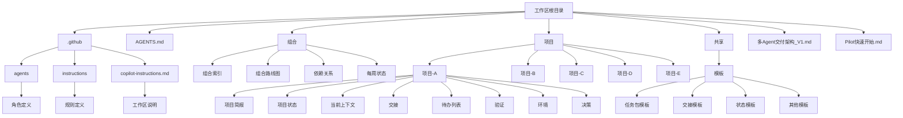

# 目录职责图

下面这张图用于快速理解这个工作区的目录分工。

```mermaid
flowchart TB
    A[工作区根目录] --> B[.github]
    A --> C[AGENTS.md]
    A --> D[组合]
    A --> E[项目]
    A --> F[共享]
    A --> G[多Agent交付架构_V1.md]
    A --> H[Pilot快速开始.md]

    B --> B1[agents]
    B --> B2[instructions]
    B --> B3[copilot-instructions.md]

    B1 --> B11[角色定义]
    B2 --> B21[规则定义]
    B3 --> B31[工作区说明]

    D --> D1[组合索引]
    D --> D2[组合路线图]
    D --> D3[依赖关系]
    D --> D4[每周状态]

    E --> E1[项目-A]
    E --> E2[项目-B]
    E --> E3[项目-C]
    E --> E4[项目-D]
    E --> E5[项目-E]

    E1 --> E11[项目简报]
    E1 --> E12[项目状态]
    E1 --> E13[当前上下文]
    E1 --> E14[交接]
    E1 --> E15[待办列表]
    E1 --> E16[验证]
    E1 --> E17[环境]
    E1 --> E18[决策]

    F --> F1[模板]
    F1 --> F11[任务包模板]
    F1 --> F12[交接模板]
    F1 --> F13[状态模板]
    F1 --> F14[其他模板]
```

## 一句话理解

- `.github/`：规则层。
- `组合/`：跨项目状态层。
- `项目/`：单项目事实层。
- `共享/模板/`：复用骨架层。
- 根目录文档：说明层。
